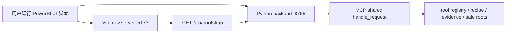

# StarBridge 产品化升级审计（P0）

> 审计基线：`origin/main` 提交 `86371fd`。本文件记录当前仓库的真实能力边界和 P1–P3 实施顺序，不代表桌面安装包已经生成或真实创意软件已经通过端到端验收。

## 结论摘要

StarBridge 已经拥有可复用的 Python CLI、MCP stdio 服务、本地 HTTP API、安全工具注册表、计划与证据模型、受保护写入策略、审计历史和矢量化引擎。当前缺口主要在产品外壳：正式桌面应用、sidecar 会话保护、生命周期管理、普通用户信息架构、官网与控制台职责分离、安装器和真实 Windows 桌面验收。

因此，本次升级应采用“保留核心、增加兼容层、迁移产品界面”的方式，而不是重写 MCP、桥接器或矢量化引擎。

## 1. 当前真实可用能力

以下“可用”只描述已经由当前仓库代码和本轮验证证明的范围。

| 产品状态 | 能力 | 当前证据边界 |
| --- | --- | --- |
| 稳定可用 | Python CLI、MCP stdio、`tools/list` / `tools/call`、resources、prompts | 完整单元测试、safe-only 清单和命令行验证通过；不等同于真实桌面软件控制 |
| 稳定可用 | `/api/health`、`/api/bootstrap`、capability matrix、recipe plan、Evidence 预览、audit history、structured errors | 本轮实际启动本地 HTTP 服务并成功请求 health/bootstrap；API 测试通过 |
| 稳定可用 | safe roots、路径脱敏、敏感内容扫描、确认门、sandbox 写入限制 | 安全检查与受保护写入测试通过 |
| 主要功能 | 匠心、智能、轻量、精确四种离线矢量化引擎 | 矢量化测试通过；输出限制在 `examples/output/vectorization/`；未在本轮启动 PySide6 GUI |
| 主要功能 | AutoCAD/DXF plan、校验、摘要和受保护 DXF 写入 | 离线测试通过；真实写入仍需确认且只能进入受控输出目录；未连接 AutoCAD |
| 主要功能 | ComfyUI workflow 草案、组合、校验、可视化和生命周期摘要 | 离线结构测试通过；本机 ComfyUI 当前不可达，未验证真实生成 |
| 稳定可用 | React/Vite 控制台生产构建 | `frontend:build` 通过；它仍是示例目录中的单页开发者控制台，不是已封装桌面产品 |

本轮工具注册表包含 83 项能力：58 项内部状态为 `stable`、17 项为 `experimental`、8 项为 `planned`；其中 56 项为安全默认，27 项需要受保护执行。内部 `stable` 表示代码、schema 或离线行为稳定，不能自动翻译为“真实软件已稳定控制”。

## 2. 实验能力

- Photoshop / Illustrator 的 COM、UXP、Node Proxy、活动文档摘要和受保护写入接口已有代码及模拟/协议测试，但本轮未连接已授权 Adobe 桌面软件。
- Illustrator 彩色矢量化 plan / compare / repair / execute 链路保留；普通图片转矢量的主路线仍是离线四模式引擎，保存为 `.ai` 需要真实 Illustrator 验证。
- ComfyUI 本地提交、队列、进度和生成结果接口有实现，但当前 `127.0.0.1:8188` 不可达，不能宣称真实生成闭环通过。
- Blender 当前可生成安全 scene plan 和参考重建 plan，未执行真实 Blender 场景或渲染。
- 剪映/CapCut 只读探针与有限目录结构摘要存在；当前未配置软件或草稿目录，也未读取真实草稿。
- StarBridge Canvas 是独立的本地 tldraw 工作区，可作为未来工作流辅助模块；它不是官网，也不是当前桌面控制台外壳。
- 现有 PySide6 VectorFlow Studio 具备拖放、四模式、后台线程、双预览、指标和打开输出目录的实现，但本轮未安装 PySide6、未做 GUI 启动验收。

## 3. 计划中能力

- 工具注册表中 8 项 Photoshop 确认写入能力仍为 `planned`。
- Tauri 2 桌面壳、PyInstaller one-folder sidecar、随机端口、会话令牌、异常恢复和退出清理尚不存在。
- Windows NSIS/MSI 安装器、代码签名、自动更新、升级/卸载/回滚验证尚不存在。
- 官网多页面路由、正式下载页、普通用户文档体系和桌面任务/证据页尚不存在。
- Photoshop、Illustrator、Blender、AutoCAD、ComfyUI、剪映/CapCut 的真实端到端桌面验收仍需对应软件、授权状态和公开测试素材。

## 4. 当前前后端启动关系

- `scripts/start_starbridge_app.ps1` 先启动 `python -m starbridge_mcp.backend`，再启动 Vite 开发服务器。
- 前端通过 `VITE_STARBRIDGE_API_URL` 调用后端；生产构建缺省可由 Python 后端从 `examples/starbridge_frontend/dist` 提供静态资源。
- 当前脚本使用固定端口 `8765` / `5173`，需要 Python、Node.js、npm 和 PowerShell。
- 前端进程退出后脚本用强制停止结束后端，没有桌面外壳级的优雅关闭、崩溃监控或恢复入口。

## 5. 桌面封装阻碍

1. 仓库没有 `apps/starbridge-desktop`、`src-tauri`、Tauri 配置、PyInstaller spec、NSIS/MSI 配置或桌面 CI。
2. 当前机器已有 Python 3.12、Node 24 和 npm 11，但没有 Rust、Cargo 或 PyInstaller；因此本轮没有运行 Tauri/PyInstaller 构建。
3. 后端虽默认只监听 `127.0.0.1`，但固定端口、无会话令牌、CORS 为 `*`，通用 `/api/tools/call` 和审计清理接口也未鉴权。
4. 后端历史默认写入仓库下的 `examples/output/app_history/history.json`；桌面版应迁移到应用数据目录，并保持输出脱敏。
5. 没有标准的 sidecar readiness 消息、健康超时、异常退出通知、优雅关闭协议和进程树清理。
6. React 前端没有路由测试或单元测试，`App.tsx` 为 693 行单文件，生产 JS 为 693.73 kB，并出现代码分割警告。
7. 版本来源分散：`pyproject.toml` 为 `0.1.0a0`，能力矩阵标题使用 v0.2，README 又使用 v0.1-alpha；桌面版本必须建立单一来源。
8. 当前“Free / Pro / Team”“cloud GPU lane”“Recipe Store”只有产品模型和 dry-run 记录，没有真实计费或云执行实现，不能继续作为本地控制台的已上线能力展示。

## 6. README 和文档结构问题

- README 共 254 行，首屏和大部分篇幅聚焦矢量化模式，弱化了 StarBridge 作为安全连接平台的核心定位。
- 状态词混用 `stable / primary / experimental / planned / not implemented`，且“CI 安全验证”和“真实桌面验收”容易被读者混为一谈。
- MCP、dry-run、sidecar、UXP、Evidence、sandbox 等术语没有稳定、集中且面向普通用户的首次解释。
- README 没有清晰区分普通用户、Codex/MCP 用户和开发者三条开始路径。
- `docs/` 当前有 78 个文件，存在多组 StarBridge、Adobe、矢量化和安装主题文档；缺少入口页和明确的单一事实来源。
- 审计开始时，目标文档 `QUICK_START.md`、`USER_GUIDE.md`、`DESKTOP_APP.md`、`SOFTWARE_SUPPORT.md` 等均不存在。
- README、ROADMAP、能力矩阵和后端产品模型之间存在版本与能力措辞漂移。

## 7. 前端信息架构问题

- 当前 React 控制台没有路由，单页同时展示软件桥、recipes、计划、Evidence、定价、云通道、Recipe Store、审计、resources 和原始 JSON。
- 工作流以内部 `recipe_id` 为主，能力卡片直接显示 `safe_default_tool_count/tool_count`，没有转换成普通语言。
- `Plan`、`Evidence`、`Run`、`Backend offline` 等关键文案没有解释影响、恢复步骤或下一步。
- 结果区域只显示 `JSON.stringify`，审计历史也没有输出文件、警告、截图/摘要和验证结果的用户视图。
- Three.js 背景持续渲染 6,200 个粒子；没有 `prefers-reduced-motion` 分支。
- CSS 有响应式断点，但没有明确的浅/深主题 token、可见焦点样式或系统化无障碍状态规则。
- `static-export` 包含硬编码演示状态，不能作为真实软件连接状态来源。
- 官网尚不存在独立路由；现有控制台不能同时承担官网职责。

## 8. 可以复用的组件

- `starbridge_mcp.backend.StarBridgeBackend`：保留路由与 MCP 兼容层，增加桌面会话鉴权、应用数据目录和生命周期接口。
- `handle_request()`、tool registry、safe roots、EvidenceManifest、JobStatus、operation context、recipe plan/evidence 和 sanitizer：全部保留。
- `/api/health`、`/api/bootstrap`、recipes、capabilities、audit history 和 structured errors：保持兼容，优先加字段而不是破坏现有字段。
- 现有 React 类型、bootstrap 数据获取、bridge 映射和 recipe action 调用可迁入正式应用，但必须拆分页面、服务和内容层。
- `starbridge_mcp/vectorization/` 的 engine、presets、CLI、SVG verifier、app model 和 PySide6 GUI：不重写引擎。
- VectorFlow Studio 采用“并行保留 + 桌面入口调用”方案：桌面控制台提供“图片矢量化”入口，现有 PySide6 工具仍可独立启动；后续再评估是否用同一引擎提供原生 Web 页面。
- StarBridge Canvas 继续作为可选本地画布模块，不混入官网或桌面首页的核心状态流。

## 9. 不应修改的安全边界

- local-first；桌面软件和用户文件默认留在本机。
- 默认只读、plan 或 dry-run。
- 真实写入必须有明确确认，并继续使用每个工具既有的确认字段。
- 写入只能进入受控输出目录，不能扩大 safe roots 以迁就桌面封装。
- 不扫描用户未明确授权的目录，不递归读取私有素材或工程。
- 不保存客户素材、Token、Cookie、账号状态或真实路径。
- 所有输出继续路径脱敏，structured errors 不泄露本机信息。
- 实验能力不得宣传为稳定能力；接口、schema 或 mock test 不是桌面验收证据。
- 桌面控制不绕过 Adobe、AutoCAD、剪映/CapCut 或其他软件自身的登录、许可证和授权。

## 10. 分阶段修改计划

### P0：审计和规划（当前阶段）

- 锁定干净的独立功能分支和远端基线。
- 建立真实能力、实验能力、计划能力和不支持能力的证据边界。
- 新增本审计与文档入口，不改产品代码。

### P1：桌面 MVP

1. 新建 `apps/starbridge-desktop/`，从现有 React/Vite 控制台迁移可复用代码，不让正式产品继续位于 `examples/`。
2. 新建 Tauri 2 外壳，只加载生产静态资源；开发模式与生产模式配置分离。
3. 为 Python backend 增加兼容的桌面启动模式：仅回环地址、随机端口、由环境传入的会话令牌、readiness 输出和受控应用数据目录。
4. 使用 `X-StarBridge-Session` 或等价会话头保护桌面 API；限制 CORS 来源；保留无鉴权的旧开发模式时必须显式启用且继续只绑定回环地址。
5. 用 PyInstaller one-folder 打包 sidecar；Tauri 启动、监控、优雅关闭，超时后再做受控终止。
6. 只实现桌面首页、连接中心、设置与诊断；普通用户不直接看到大段 JSON。
7. 增加 sidecar 启动、health、异常退出、应用退出清理、空状态、中文与空格路径测试。

### P2：信息与视觉重构

1. README 改为普通用户层 + 开发者层的双层结构，统一中文主文案和能力状态。
2. 建立目标文档体系和术语单一来源，旧文档通过索引归档或定向引用，避免复制。
3. 官网与桌面控制台分成独立应用/路由；官网只负责解释、下载、文档和路线图。
4. 桌面端增加工作流、执行确认、任务、历史与证据页面；原始 JSON 放入技术详情折叠区。
5. 建立设计 token、键盘焦点、减弱动画、响应式和普通语言错误/空状态。

### P3：发布准备

1. 建立单一版本源、Release Notes、构建产物清单和 SHA-256 校验。
2. 配置 NSIS 为首选安装器，并评估 MSI；不要求管理员权限作为默认路径。
3. 增加 Windows 构建草案、安装/升级/卸载/回滚清单和 Defender/杀软误报记录。
4. 记录代码签名和自动更新方案；没有证书和真实签名证据时不得标记为完成。
5. 只有安装包实际构建、安装并完成首次启动验证后，才发布“可下载 Windows 版”。

## P0 验证记录

| 检查 | 结果 | 备注 |
| --- | --- | --- |
| `python -m ruff check .` | 通过 | Ruff 缓存目录有访问警告，不影响检查结果 |
| `python -m ruff format --check .` | 通过 | 183 个 Python 文件格式符合要求 |
| `python scripts/security_check.py` | 通过 | 未发现受禁扩展名或敏感路径模式 |
| `python examples/bridge_status.py --json --redact-paths --soft-exit` | 通过 | ComfyUI/Blender 未找到，Adobe/剪映未配置；按设计返回结构化状态 |
| `python -m starbridge_mcp.server tools --json --safe-only` | 通过 | 返回 56 项安全默认能力 |
| `python -m unittest discover -s tests` | 通过 | 在仓库虚拟环境中运行 502 项，跳过 4 项 |
| `npm.cmd test` | 通过 | 使用同一虚拟环境运行 502 项，跳过 4 项 |
| `npm.cmd run frontend:build` | 通过 | Vite 生产构建成功；存在 693.73 kB chunk 警告 |
| 实际 HTTP health/bootstrap | 通过 | 临时随机端口启动后端；health/bootstrap 均返回成功 |
| Tauri / PyInstaller / 安装器 | 未运行 | 仓库尚无桌面工程，当前机器也没有 Rust/Cargo/PyInstaller |
| Playwright 页面截图 | 未运行 | 现有前端没有测试配置；在 P1/P2 建立正式应用后补充 |
| 真实 Adobe/Blender/AutoCAD/ComfyUI/剪映 | 未运行 | 缺少对应本地软件、运行服务、授权或公开测试素材证据 |

首次直接使用系统 Python 运行单测时，5 个矢量化测试模块因 Pillow 未安装而导入失败；在仓库私有虚拟环境按 CI 依赖安装后，完整测试通过。该环境问题没有被记为代码通过，也没有被隐藏。
