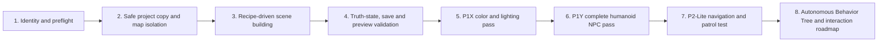

# WorldForge public system overview

## Current mission

先让 Codex 稳定接入 UE，能够打开工程、制作和优化基础场景、创建基础 NPC、自动保存与测试，再逐步扩展到角色动画、交互逻辑和可玩的游戏内容。

WorldForge is organized as a guarded editor-automation system, not as a claim that one prompt already produces a finished game.

## Layer map

| Layer | Public implementation | Responsibility | Current truth |
| --- | --- | --- | --- |
| Identity and safety | `evidence/audit_baseline`, `SECURITY_BOUNDARY.md` | Confirm project/version, protect originals, stop unsafe work | Proven locally; machine-specific registry stays private |
| Control layer | `control_layer/` | Offline tasks, schemas, guarded execution and receipts | Included |
| Reusable UE Python | `ue_project/Content/Python/worldforge/` | Preflight, recipes, building, saving, preview and validation | Included |
| Scene content | `ue_project/Content/WorldForge/` | Public sample maps, materials, Blueprints and editor utilities | Included as compact evidence assets |
| Truth and recovery | `evidence/state`, `evidence/receipts`, `evidence/checkpoints` | Separate requested work from real assets, saves, previews and editor state | Included |
| P1Y stabilization | `p1y_color_stability/` | Fixed exposure, restrained lighting, complete humanoids, save/reopen verification | P1Y PASS |
| P2-Lite | `p1y_color_stability/scripts/` | Dynamic NavMesh and 65-second external patrol verification | PARTIAL; Behavior Tree is not wired |
| Remote control/MCP | handoff documents only | Future loopback-only command gate and stdio bridge | Not enabled |

## Execution contract

Each WorldForge run follows the same contract:

1. Resolve the actual `.uproject` from live process, window, map and log evidence.
2. Re-read disk, memory, UE responsiveness and error state.
3. Back up small control/config files and preserve the original map.
4. Apply idempotent changes only to the selected working map.
5. Save, switch away, reopen and compile the affected assets.
6. Run proportionate PIE validation and record observable metrics.
7. Publish only sanitized scripts and truth summaries; keep raw logs, caches, licensed assets and private paths local.

## Current capability boundary

| Capability | State | Evidence |
| --- | --- | --- |
| Open and identify the correct UE project | Verified | preflight/audit evidence and P1Y run |
| Build and optimize basic scenes | Verified prototype | WF0009, WF0010, low-rise tech-hub and P1Y records |
| Stabilize exposure and color hierarchy | Verified | P1Y public status/validation |
| Create complete basic humanoid NPCs | Verified | three complete Manny/Quinn-based NPC records |
| Save, reopen and compile | Verified | P1Y reopen and compile summary |
| Idle/walk animation in PIE | Verified through test harness | P2-Lite metrics |
| Dynamic NavMesh | Verified | dynamic generation persisted after reopen |
| Autonomous Behavior Tree patrol | Partial | assets exist; graph is not wired |
| Remote MCP control of Unreal | Not enabled | safety handoff only |
| One-prompt finished playable game | Not claimed | roadmap item |

## Publication boundary

The public system is intentionally smaller than the local working system. It excludes real absolute paths, usernames, machine names, process IDs, raw UE logs, crash dumps, caches, editor recovery data, full private projects, external character assets and temporary screenshots. `RUN_HISTORY.md` records excluded diagnostic work by category so the history remains understandable without publishing private machine state.
